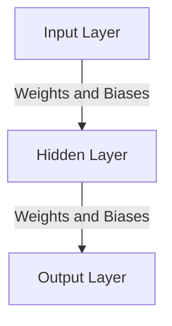
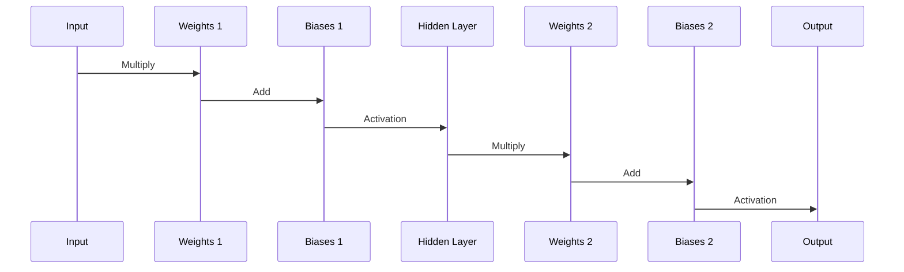
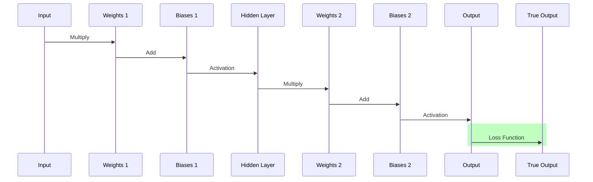
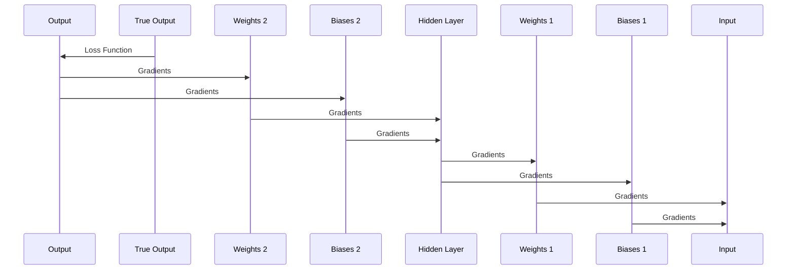
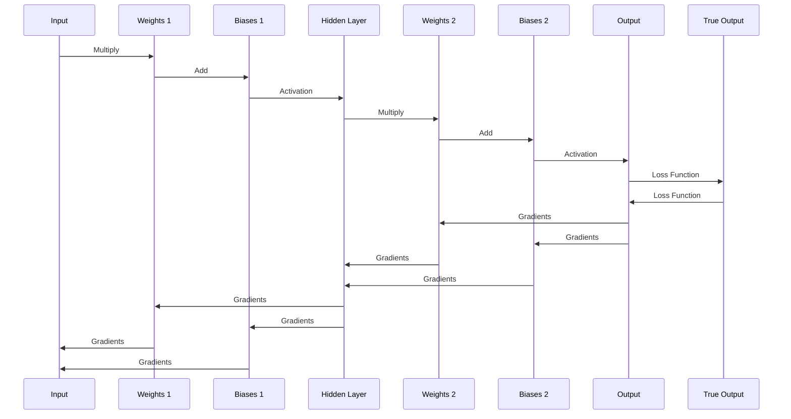

```
Watch a great overview: https://www.youtube.com/watch?v=TkwXa7Cvfr8
```

# Neural networks are function approximators

Neural networks are function approximators. They are used to approximate
functions that are too complex to be represented by a simple mathematical
formula. This is done by training the network on a dataset of input-output
pairs. The network learns to map inputs to outputs by adjusting its internal
parameters, which are called weights and biases. Once trained, the network can
be used to make predictions on new inputs.

A neural network is composed of layers of neurons, which are interconnected by
edges. Each neuron computes a weighted sum of its inputs, applies an activation
function to the result, and passes the output to the neurons in the next layer.

The weights and biases of the network are learned through a process called
backpropagation. This is an iterative algorithm that adjusts the parameters of
the network in order to minimize the difference between the predicted outputs
and the true outputs.

The process of training a neural network involves feeding the inputs forward
through the network, computing the predicted outputs, and then using the
difference between the predicted and true outputs to update the parameters of
the network. This process is repeated many times until the network's
predictions are accurate enough.

The way these weights and biases are represented in the network are as vectors
and matrices. The weights are the parameters that the network learns to
approximate the function, and the biases are the parameters that the network
learns to shift the function. The weights and biases are adjusted during
training in order to minimize the difference between the predicted outputs and
the true outputs.

Let's draw a diagram of a neural network with 3 layers. The input layer has 3
neurons, the hidden layer has 4 neurons, and the output layer has 2 neurons.



The weights and biases are represented as matrices and vectors. The weights
matrix for the connections between the input layer and the hidden layer is
denoted as W1, and the biases vector for the hidden layer is denoted as b1. The
weights matrix for the connections between the hidden layer and the output
layer is denoted as W2, and the biases vector for the output layer is denoted
as b2.

Let's draw a table to represent the weights and biases of the network.

| Layer  | Neurons | Weights | Biases |
| ------ | ------- | ------- | ------ |
| Input  | 3       |         |        |
| Hidden | 4       | W1      | b1     |
| Output | 2       | W2      | b2     |

# The Forward Pass

The forward pass is the process of feeding the inputs forward through the
network and computing the predicted outputs. This is done by applying the
weights and biases to the inputs and passing the result through the activation
functions of the neurons.

The forward pass can be represented as a series of matrix multiplications and
additions. The inputs are multiplied by the weights of the input layer to the
hidden layer, and the result is added to the biases of the hidden layer. The
result is then passed through the activation function of the hidden layer to
produce the inputs to the output layer. The inputs to the output layer are
multiplied by the weights of the hidden layer to the output layer, and the
result is added to the biases of the output layer. The result is then passed
through the activation function of the output layer to produce the predicted
outputs.

The forward pass can be represented as follows:

```
h1 = activation(W1 * x + b1)
y = activation(W2 * h1 + b2)
```

Where x is the input vector, W1 and W2 are the weights matrices, b1 and b2 are
the biases vectors, h1 is the hidden layer output, and y is the predicted
output.

Let's draw a sequence diagram of the forward pass.



# Activation Functions

The activation functions of the neurons are used to introduce non-linearity
into the network. This allows the network to approximate complex functions
that are not linear. There are many different activation functions that can be
used, such as the sigmoid function, the hyperbolic tangent function, and the
rectified linear unit (ReLU) function.

The sigmoid function is defined as:

```
sigmoid(x) = 1 / (1 + exp(-x))
```

The hyperbolic tangent function is defined as:

```
tanh(x) = (exp(x) - exp(-x)) / (exp(x) + exp(-x))
```

The ReLU function is defined as:

```
ReLU(x) = max(0, x)
```

Each of these activation functions has its own properties and is suitable for
different types of problems. The choice of activation function depends on the
specific problem being solved and the characteristics of the data.

# The Loss Function

The loss function is used to measure the difference between the predicted
outputs and the true outputs. The loss function is a measure of how well the
network is performing, and it is used to guide the process of updating the
weights and biases of the network.

There are many different loss functions that can be used, such as the mean
squared error (MSE) function, the cross-entropy function, and the hinge loss
function.

The mean squared error function is defined as:

```
MSE(y, t) = (1 / n) * sum((y - t)^2)
```

The cross-entropy function is defined as:

```
cross_entropy(y, t) = -sum(t * log(y) + (1 - t) * log(1 - y))
```

The hinge loss function is defined as:

```
hinge_loss(y, t) = max(0, 1 - y * t)
```

Each of these loss functions has its own properties and is suitable for
different types of problems. The choice of loss function depends on the
specific problem being solved and the characteristics of the data.

Let's draw a table to represent the loss function.

| Function           | Definition                              |
| ------------------ | --------------------------------------- |
| Mean Squared Error | (1 / n) \* sum((y - t)^2)               |
| Cross-Entropy      | -sum(t _ log(y) + (1 - t) _ log(1 - y)) |
| Hinge Loss         | max(0, 1 - y \* t)                      |

Let's draw a sequence diagram of the forward pass and the loss function.



# The Backward Pass

The backward pass is the process of updating the weights and biases of the
network in order to minimize the difference between the predicted outputs and
the true outputs. This is done by computing the gradients of the loss function
with respect to the weights and biases, and then using these gradients to
update the parameters of the network.

The gradients are computed using the chain rule of calculus, which allows the
gradients of the loss function to be expressed in terms of the gradients of the
activation functions. The gradients are then used to update the weights and
biases of the network using an optimization algorithm, such as gradient
descent.

The process of updating the weights and biases of the network is repeated many
times until the network's predictions are accurate enough. This process is
called training, and it is the most important part of building a neural
network.

Let's draw a sequence diagram of the backward pass.



# Putting It All Together

In summary, a neural network is a function approximator that is trained on a
dataset of input-output pairs. The network is composed of layers of neurons,
which are interconnected by edges. The weights and biases of the network are
learned through a process called backpropagation, which adjusts the parameters
of the network in order to minimize the difference between the predicted
outputs and the true outputs.

Let's draw a complete sequence diagram of the forward pass, the loss function,
and the backward pass.


