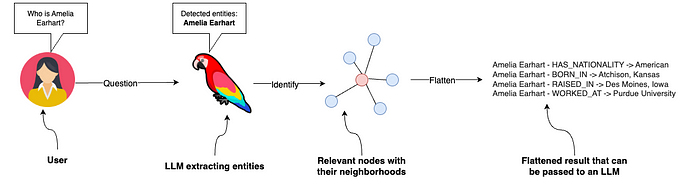
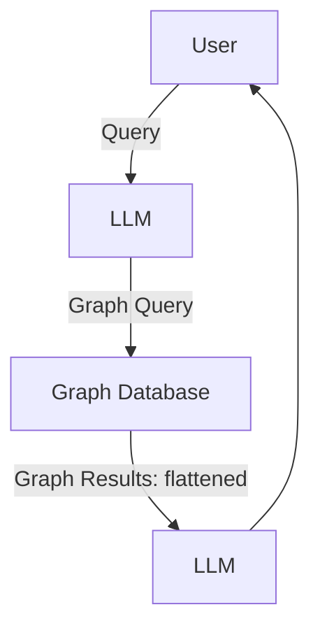

## Remote Data Storage

Options:

1. Blob
2. NoSQL
3. SQL
4. Graph
5. Time Series
6. Key-Value
7. Document
8. Vector
9. Multi-Model

Strategies:

-   using primary key for inter-modal connections between storage types

| Storage Type        | Pros                                                         | Cons                                |
| ------------------- | ------------------------------------------------------------ | ----------------------------------- |
| Vector Store        | Designed for fast cosine similarity search                   | Limited relational capabilities     |
| Graph Database      | Enables queries based on relationships                       | Limited to graph-based queries      |
| Hybrid Vector-Graph | Combines the capabilities of both vector and graph databases | Highly specialized = vendor lock-in |
| Multi-Model         | Supports multiple data models                                | Increased infrastructure complexity |

Products

-   Vector Store:
    -   Azure Cognitive Search
    -   QDrant
    -   Milvus
    -   Pinecone
    -   Annoy
-   Graph Database:
    -   Neo4j
    -   Amazon Neptune
    -   ArangoDB
    -   TigerGraph
    -   Dgraph
    -   JanusGraph
    -   [Nebula Graph](https://www.nebula-graph.io/)
-   Hybrid Vector-Graph:
    -   CozoDB
    -   [Dgraph]()

## Graph Retrieval ➡ LLM

Effectively, the pipeline between a graph database and an LLM has the following workflow

1. User submits a query
2. LLM used to generate a graph query from the user query
3. Graph database used to retrieve the graph query
4. Results from the graph search are flattened into a list
5. LLM used to generate a response from the list

