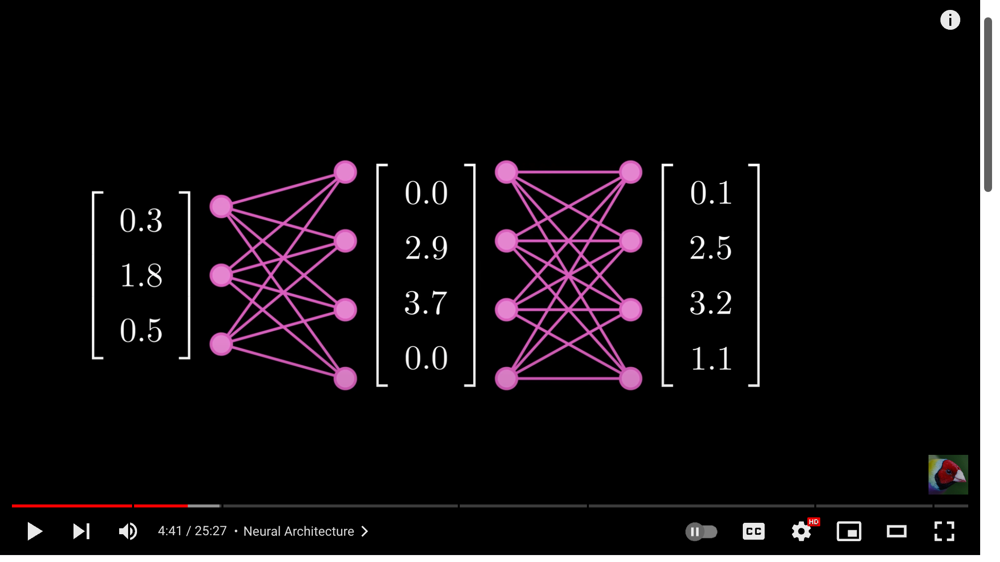
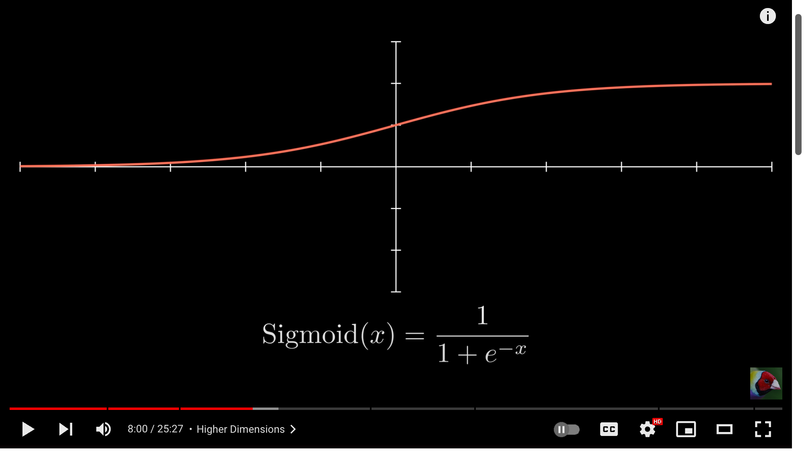

```
Watch a great overview: https://www.youtube.com/watch?v=TkwXa7Cvfr8
```

# Neural networks are "universal" function approximators

Neural networks are function approximators. They are used to approximate
functions that are too complex to be represented by a simple mathematical
formula. This is done by training the network on a dataset of input-output
pairs. The network learns to map inputs to outputs by adjusting its internal
parameters, which are called weights and biases. Once trained, the network can
be used to make predictions on new inputs.

\(f(x) \sim NN(x)\)

Where \(f(x)\) is the true function, and \(NN(x)\) is the neural network's
approximation of the function.

|                         |                                                                                                                                                                   |
| ----------------------- | ----------------------------------------------------------------------------------------------------------------------------------------------------------------- |
|   | In conventional programming, we create functions that take input data and produce output data                                                                     |
|   | For example, we can use a \(sin\) function to have a deterministic effect \(y\) for any given input \(x\)                                                         |
|   | In two-dimensional space, we can plot the \(sin\) function as a curve that maps every \(x\) to a \(y\)                                                            |
|   | If we don't have a function - but do have inputs and outputs - we can use a NN to approximate the function                                                        |
|   | Training a NN involves tweaking the network parameters to minimize error between predicted and true outputs                                                       |
|   | We can leverage the same NN to approximate different functions by training it on different datasets                                                               |
|   | Thus a NN is a "universal" function approximator, capable of learning and approximating any function                                                              |
|   | A NN is a graph composed of layers of **neurons**, which are interconnected by **edges**. These layers connect inputs to predicted outputs.                       |
|   | A **neuron** is a tiny mathematical function that has many inputs and a single output.                                                                            |
|  | We calculate the output of a neuron by summing the products of its inputs and their corresponding weights.                                                        |
|  | We add an additional weight to the sum, called the **bias** to enable the network to shift the function.                                                          |
|  | We use matrix multiplication to calculate the effect of the weights and biases on the inputs, where the weights are the parameters of the network.                |
|  | Here's an example of the dot product of a matrix and a vector.                                                                                                    |
|  | We then sum the result of that dot product.                                                                                                                       |
|  | We then apply an **activation function** to the result of the sum to introduce non-linearity into the network.                                                    |
|  | This non-linearity allows the network to approximate complex, multi-variable functions.                                                                           |
|  | The **ReLU** function is a common activation function                                                                                                             |
|  | For any value of \(x\), the ReLU function returns \(x\) if \(x\) is positive, and \(0\) otherwise                                                                 |
|  | The output of the activation function is then passed to the neurons in the next layer                                                                             |
|  | These calculations are repeated for each layer of the network, until the final output is produced                                                                 |
|  | As more layers are added to the network, it becomes capable of approximating more complex functions                                                               |
|  | More complex functions are better equipped to approximate real-world phenomena                                                                                    |
|  | We measure the difference between the predicted outputs and the true outputs using a **loss function**. Here a simple function is approximated: \(y = f(x)\)      |
|  | Over-fitting can occur when the network learns to memorize the training data, rather than learning to find the underlying patterns in the data.                   |
|  | This can be visualized for lower-dimensional data as the distance between the predicted and true outputs                                                          |
|  | Let's say we need to predict the value of a pixel given a row and column index of the pixel. Here \(R^2 \rightarrow R^1\), where \(R\) is the set of real numbers |
|  | And our data set is all the pixels in this image, and \(R^2\) is the set of all possible row/column inputs and \(R^1\) is the set of all possible pixel values    |
|  | As we train, we can view the function approx. as a 2d plane, and for each pixel, we can view the predicted value                                                  |
|  | Our row/column inputs range from 0 to 1439, and the pixel values range from 0 to 255                                                                              |
|  | So, we scale the values to -1 to 1, because it's smaller and centered around 0, which is better for approximation                                                 |
|  | We are also going to use a "Leaky ReLU" activation function, can output negative values, but are small                                                            |
|  | because the final output is a pixel value, we need the output to be between 0 and 1                                                                               |
|  | We can use sigmoid activation function to scale the output to the desired range                                                                                   |
|  | However, using a normalized tanh activation function is better for the network                                                                                    |
|  | We can verify this by looking at the loss function, which is the difference between the predicted and true outputs                                                |
|  | Let's attempt to approximate a parametric surface, that takes a 2d input and produces a 3d output                                                                 |
|  | Let's use a dataset created by sampling the surface of a sphere, and use a NN to approximate the surface                                                          |
|  | We can visualize the approximation as a 3d surface, and for each input, we can view the predicted output                                                          |
|  | A similar approach can be used to approximate a function that takes a hand-drawn number and produces a predicted digit (label)                                    |
|  | The image is made of 28x28 pixels, and the label is a number from 0 to 9                                                                                          |
|  | The NN's job is to produce a probability distribution over the 10 possible labels for any given input image                                                       |


# The Forward Pass

The forward pass is the process of feeding the inputs forward through the
network and computing the predicted outputs. This is done by applying the
weights and biases to the inputs and passing the result through the activation
functions of the neurons.

The forward pass can be represented as a series of matrix multiplications and
additions. The inputs are multiplied by the weights of the input layer to the
hidden layer, and the result is added to the biases of the hidden layer. The
result is then passed through the activation function of the hidden layer to
produce the inputs to the output layer. The inputs to the output layer are
multiplied by the weights of the hidden layer to the output layer, and the
result is added to the biases of the output layer. The result is then passed
through the activation function of the output layer to produce the predicted
outputs.

The forward pass can be represented as follows:

```
h1 = activation(W1 * x + b1)
y = activation(W2 * h1 + b2)
```

Where x is the input vector, W1 and W2 are the weights matrices, b1 and b2 are
the biases vectors, h1 is the hidden layer output, and y is the predicted
output.

# Activation Functions

The activation functions of the neurons are used to introduce non-linearity
into the network. This allows the network to approximate complex functions
that are not linear. There are many different activation functions that can be
used, such as the sigmoid function, the hyperbolic tangent function, and the
rectified linear unit (ReLU) function.

The sigmoid function is defined as:

```
sigmoid(x) = 1 / (1 + exp(-x))
```

The hyperbolic tangent function is defined as:

```
tanh(x) = (exp(x) - exp(-x)) / (exp(x) + exp(-x))
```

The ReLU function is defined as:

```
ReLU(x) = max(0, x)
```

Each of these activation functions has its own properties and is suitable for
different types of problems. The choice of activation function depends on the
specific problem being solved and the characteristics of the data.

# The Loss Function

The loss function is used to measure the difference between the predicted
outputs and the true outputs. The loss function is a measure of how well the
network is performing, and it is used to guide the process of updating the
weights and biases of the network.

There are many different loss functions that can be used, such as the mean
squared error (MSE) function, the cross-entropy function, and the hinge loss
function.

The mean squared error function is defined as:

```
MSE(y, t) = (1 / n) * sum((y - t)^2)
```

The cross-entropy function is defined as:

```
cross_entropy(y, t) = -sum(t * log(y) + (1 - t) * log(1 - y))
```

The hinge loss function is defined as:

```
hinge_loss(y, t) = max(0, 1 - y * t)
```

Each of these loss functions has its own properties and is suitable for
different types of problems. The choice of loss function depends on the
specific problem being solved and the characteristics of the data.

Let's draw a table to represent the loss function.

| Function           | Definition                              |
| ------------------ | --------------------------------------- |
| Mean Squared Error | (1 / n) \* sum((y - t)^2)               |
| Cross-Entropy      | -sum(t _ log(y) + (1 - t) _ log(1 - y)) |
| Hinge Loss         | max(0, 1 - y \* t)                      |

# The Backward Pass

The backward pass is the process of updating the weights and biases of the
network in order to minimize the difference between the predicted outputs and
the true outputs. This is done by computing the gradients of the loss function
with respect to the weights and biases, and then using these gradients to
update the parameters of the network.

The gradients are computed using the chain rule of calculus, which allows the
gradients of the loss function to be expressed in terms of the gradients of the
activation functions. The gradients are then used to update the weights and
biases of the network using an optimization algorithm, such as gradient
descent.

The process of updating the weights and biases of the network is repeated many
times until the network's predictions are accurate enough. This process is
called training, and it is the most important part of building a neural
network.

# Putting It All Together

In summary, a neural network is a function approximator that is trained on a
dataset of input-output pairs. The network is composed of layers of neurons,
which are interconnected by edges. The weights and biases of the network are
learned through a process called backpropagation, which adjusts the parameters
of the network in order to minimize the difference between the predicted
outputs and the true outputs.
